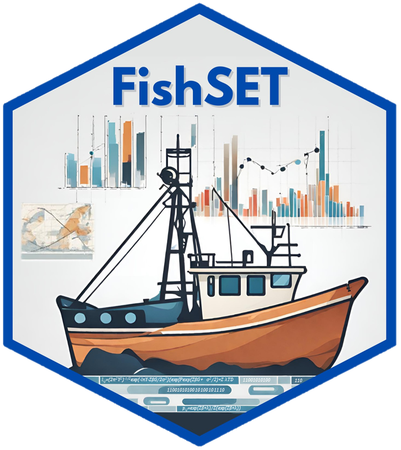

# FishSET 

<!-- badges: start -->

[](https://github.com/noaa-nwfsc/FishSET/actions/workflows/R-CMD-check.yaml) [](https://github.com/noaa-nwfsc/FishSET/actions/workflows/secretScan.yml) [](https://lifecycle.r-lib.org/articles/stages.html#experimental)

<!-- badges: end -->

Contact [nmfs.fishset\@noaa.gov](mailto:nmfs.fishset@noaa.gov){.email} with any questions regarding the FishSET R package and to report issues.

## Overview

The Spatial Economics Toolbox for Fisheries (FishSET) is a set of tools developed as an R package for organizing and visualizing data; developing, improving and disseminating modeling best practices; and simulating policy scenarios to explore the welfare consequences of management decisions.

## GitHub Install

Run the following lines of code in R:

IMPORTANT NOTE - when asked to update packages in the R console, enter an empty line and FishSET will load the required versions for package dependencies.

```         
# Install the package (see troubleshooting section below if this doesn't work)
install.packages("pak", repos = sprintf("https://r-lib.github.io/p/pak/stable/%s/%s/%s", .Platform$pkgType, R.Version()$os, R.Version()$arch))
options(pkg.build_vignettes = FALSE) # This prevents the vignettes from installing (set to TRUE to install vignettes). Vignettes can take a while to install, and are already included in the FishSET website (https://noaa-nwfsc.github.io/FishSET/). 
pak::pak("noaa-nwfsc/FishSET")
```

If the "pak" method fails to install FishSET, try using the "devtools" method below.

```         
# Install the package (see troubleshooting section below if this doesn't work)
install.packages("devtools")
options(download.file.method = "wininet")
devtools::install_github("noaa-nwfsc/FishSET")
```

## Local Install

Use this option if remote installation from GitHub fails.

1.  Click on the [current release version](https://github.com/noaa-nwfsc/FishSET/releases) in the right side panel of the FishSET repo.
2.  Download the tar.gz file.
3.  Open RStudio and select "Tools" from the top menu bar.
4.  Select "Install Packages...", and install from "Package Archive File (.zip; .tar.gz)"
5.  Click on the "Browse..." button and select the downloaded tar.gz file.
6.  Click "Install"

Note: after downloading the file from GitHub (step 2 above), the following line of code can be used to install the package from the R console.

```         
install.packages("[file path to tar.gz file]", repos = NULL, type = "source")
```

## Documentation and Tutorials

Refer to the [FishSET R Package User Manual](https://noaa-nwfsc.github.io/FishSET/articles/FishSET_User_Manual.html) for more package information, quickstart guides, and troubleshooting tips.

## Publications

Carvalho P., Pfeiffer L., Abelman A., Lee M.-Y., and Haynie A. The Spatial Economics Toolbox for Fisheries (FishSET) is an R package for modeling fisher behavior and simulating policy scenarios. *ICES J Mar Sci* 2026; 83(3) fsag032. [https://doi.org/10.1093/icesjms/fsag032](https://academic.oup.com/icesjms/article/83/3/fsag032/8540085)

## <a name="cite"> Citation </a>

If you use FishSET results in publications, please cite the package:

Lisa Pfeiffer, Paul Carvalho, Anna Abelman, Alan Haynie. (2026). FishSET: Spatial Economics Toolbox for Fisheries. R package version 2.0.0 https://doi.org/10.5281/zenodo.21796076

## Troubleshooting

<details>

<summary>Error in utils::download.file(url, path, method = method, quiet = quiet...</summary>

Run the following line of code, then run remotes::install_github

`options(download.file.method = "wininet")`

</details>

<details>

<summary>Error in dyn.load(file, DLLpath = DLLpath, ...): unable to load shared object ...</summary>

This error message indicates that the filepath to a necessary package is 'corrupted' and cannot load properly. To fix this issue, reinstall the package indicated in the error message using `install.packages([Name of package])` and restart the R session. If the issue persists, try uninstalling and reinstalling R/RStudio. If both options fail, report the issue (<https://github.com/noaa-nwfsc/FishSET/issues>).

</details>

<details>

<summary>Error: failed to lock directory...</summary>

This error could appear when your last package installation was interrupted, when updated you version of R, and probably other situations that we are not aware of.

1.  Locate and delete the ".../00LOCK-[packagename]" and "[packagename]" folders in the library folder, which should be displayed with the error message (this can also be done using the unlink() function in R), then attempt to reinstall the problem package using install.packages(). If FishSET is the problem package, follow the steps above to install again.

2.  If the first options does not work, try adding "--no-lock" to your install options: "install.packages(INSTALL_opts = '--no-lock')"

3.  If this still doesn't work, try using `pacman::p_unlock(lib.lock=path_to_directory)`

</details>

<details>

<summary>Error: object 'attr' is not exported by 'namespace:[package]'...</summary>

This error indicates a namespace version mismatch between an updated package and an older dependency installed in your local R library. It occurs when an upstream package updates and deprecates or renames an internal export that a downstream dependency is still trying to call. 

1. Update the affected package and its dependencies
Reinstall the offending package alongside its primary dependencies simultaneously:
```
# Replace 'package_name' with the package named in the error (e.g., xfun, rlang, cli)
install.packages(c("package_name", "knitr", "rmarkdown"), dependencies = TRUE)
```

2. Update all installed R packages:
```
update.packages(ask = FALSE, checkBuilt = TRUE)
```

3. Upgrade R
If issues continue, upgrading to the latest version of R will build a clean package library and eliminate stale dependency conflicts.

</details>


## Issues and Bug Reports

Add issues in GitHub <https://github.com/noaa-nwfsc/FishSET/issues>. Or contact [nmfs.fishset\@noaa.gov](mailto:nmfs.fishset@noaa.gov){.email}.

## Disclaimer

This repository is a scientific product and is not official communication of the National Oceanic and Atmospheric Administration, or the United States Department of Commerce. All NOAA GitHub project code is provided on an ‘as is’ basis and the user assumes responsibility for its use. Any claims against the Department of Commerce or Department of Commerce bureaus stemming from the use of this GitHub project will be governed by all applicable Federal law. Any reference to specific commercial products, processes, or services by service mark, trademark, manufacturer, or otherwise, does not constitute or imply their endorsement, recommendation or favoring by the Department of Commerce. The Department of Commerce seal and logo, or the seal and logo of a DOC bureau, shall not be used in any manner to imply endorsement of any commercial product or activity by DOC or the United States Government.

## License

This content was created by U.S. Government employees as part of their official duties. This content is not subject to copyright in the United States (17 U.S.C. §105) and is in the public domain within the United States of America. Additionally, copyright is waived worldwide through the MIT License.


[U.S. Department of Commerce](https://www.commerce.gov/) \| [National Oceanographic and Atmospheric Administration](https://www.noaa.gov) \| [NOAA Fisheries](https://www.fisheries.noaa.gov/)
