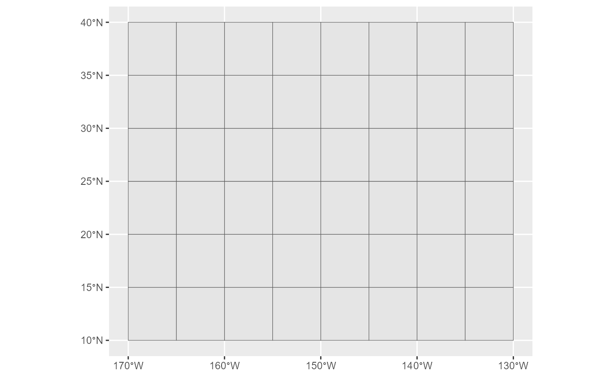
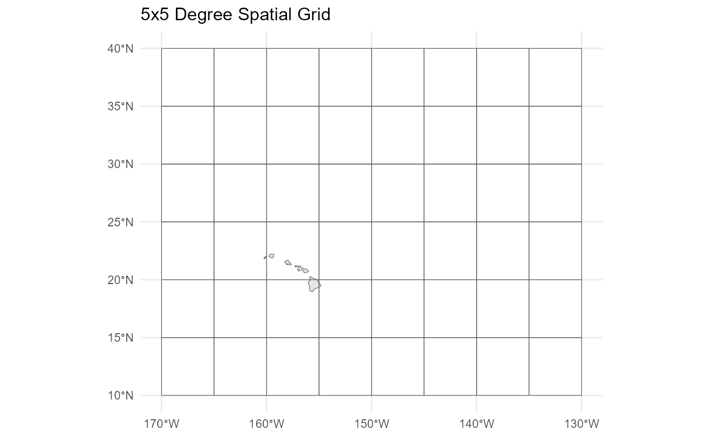

# Making a spatial grid file

## Load packages

``` r

library(sf) 
```

    ## Warning: package 'sf' was built under R version 4.5.3

    ## Linking to GEOS 3.14.1, GDAL 3.12.1, PROJ 9.7.1; sf_use_s2() is TRUE

``` r

library(ggplot2)
```

    ## Warning: package 'ggplot2' was built under R version 4.5.3

## Create a spatial grid

``` r

# Define the bounding box of the grid
# latitude: 10 to 40 degrees N
# longitude: -170 to -130 degrees W
bbox <- c(xmin = -170, xmax = -130, ymin = 10, ymax = 40)

# Define the size of each grid cell
# 5 degree x 5 degree grid
cell_size <- c(x = 5, y = 5)

# Create the grid
grid_sf <- st_make_grid(
  st_as_sfc(st_bbox(bbox)),  # Bounding box for the grid
  cellsize = cell_size,       # Size of each cell
  what = "polygons"           # Grid cells as polygons
)

# Convert to an sf object
grid_sf <- st_sf(geometry = grid_sf, crs = 4326)
```

If you have a spatial data table loaded as a dataframe, use the
[st_as_sf()](https://www.rdocumentation.org/packages/sf/versions/1.0-16/topics/st_as_sf)
function from the
[sf](https://www.rdocumentation.org/packages/sf/versions/1.0-16) package
to convert the dataframe to an sf object.

### Add zone ID variable to the spatial object

``` r

# Assign zone ID variable
# Here the ID is just a sequence from 1 to the total number of grids in the spatial object
grid_sf$zoneID <- seq(1:length(grid_sf$geometry))
```

**IMPORTANT NOTE: if a zone ID variable already exists in the primary
data table, this will need to be reassigned based on the zone ID
assigned here for the spatial object. See last section of this vignette
on reassigning the zone ID in the primary data table.**

### Plot

``` r

# Plot just the spatial grid object using the ggplot2 package
ggplot() +
  geom_sf(data = grid_sf)
```



``` r

# Add a world map layer to the plot
base_map <- ggplot2::map_data("world",
                              xlim = c(bbox["xmin"], bbox["xmax"]),
                              ylim = c(bbox["ymin"], bbox["ymax"]))

base_map <- FishSET::dat_to_sf(base_map, lon = "long", lat = "lat", id = "group",
                        cast = "POLYGON", multi = TRUE, crs = 4326)

ggplot() +
  geom_sf(data = base_map) +
  geom_sf(data = grid_sf, fill=NA) +
  theme_minimal() +
  labs(title = "5x5 Degree Spatial Grid")
```



### Save spatial grid

``` r

# Uncomment the code below to save the spatial grid as an RDS file to be used in FishSET
# Note: the second input should include the filepath and filename to be saved. See help documentation for saveRDS().

# saveRDS(grid_sf, "fiveByFiveGrid.rds")
```

### Reassign zone ID in primary data

The zone ID variable in the primary data table can be reassigned to
match the zone IDs in the spatial grid object based on the lat/lon of
fishing location in the primary data table.

Use the
[`assignment_column()`](https://noaa-nwfsc.github.io/FishSET/reference/assignment_column.html)
function in FishSET to reassign zone IDs in the primary data table.

If using the FishSET GUI: navigate to the **Select variables** tab, use
the *Create zone ID column* button, and follow the directions to
reassign zone IDs in the primary data table.
