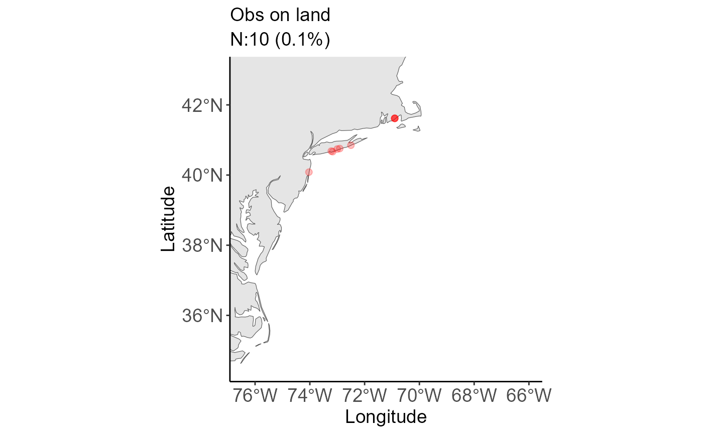
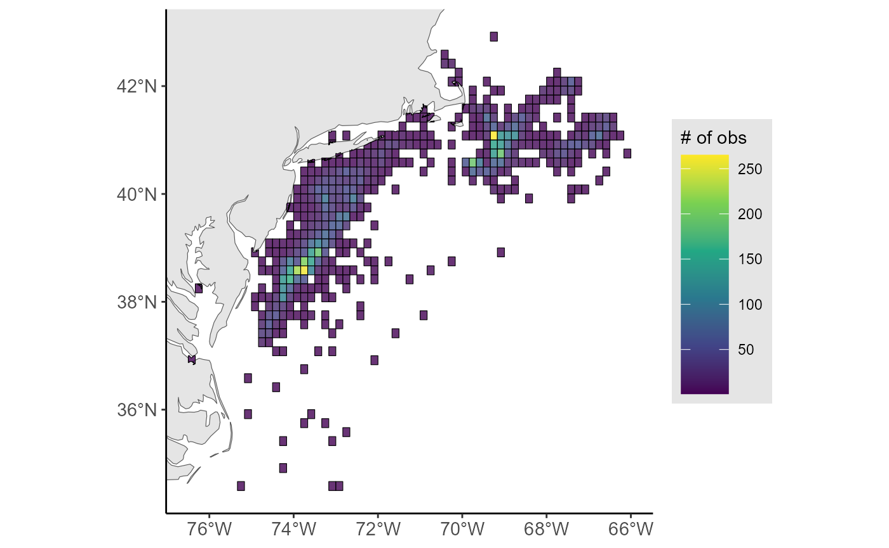
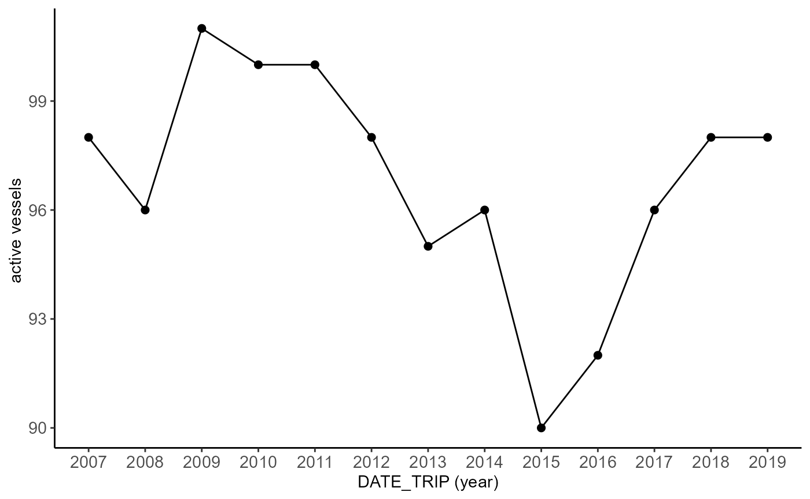
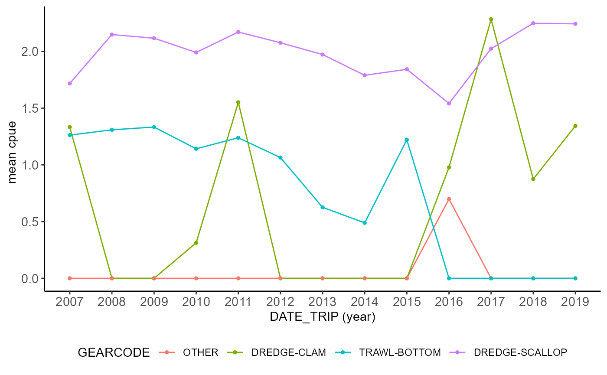

# Scallop End-to-End Workflow

## Overview

This vignette walks through the core FishSET workflow on the bundled
scallop example data. It starts with raw data loading, moves through
QA/QC and data reshaping, and ends with model fitting and diagnostics.

### Setup and data loading

We first load FishSET and the example datasets, then place the project
in a temporary working folder so the vignette can run without
user-specific paths. This keeps the example reproducible while still
using the same database-backed workflow as a real project.

The example data cover three pieces of the workflow: trip-level records,
port locations, and the zone polygons used to assign fishing choices. A
quick look at their structure helps confirm the variables needed later
in the workflow are present.

``` r

str(scallop[, c("TRIPID", "DATE_TRIP", "PERMIT.y", "DDLAT", "DDLON",
                "ZoneID", "LANDED_OBSCURED", "DOLLAR_OBSCURED")])
```

    ## tibble [10,000 × 8] (S3: tbl_df/tbl/data.frame)
    ##  $ TRIPID         : int [1:10000] 22 65 466 12 6 830 43 57 399 363 ...
    ##  $ DATE_TRIP      : POSIXct[1:10000], format: "2007-05-01 05:00:00" "2007-05-01 06:00:00" ...
    ##  $ PERMIT.y       : int [1:10000] 55 305 126 198 224 218 1 356 383 162 ...
    ##  $ DDLAT          : num [1:10000] 39 38.5 39.8 38.5 38.6 ...
    ##  $ DDLON          : num [1:10000] -73.7 -74.1 -72.5 -74.1 -73.9 ...
    ##  $ ZoneID         : num [1:10000] 387312 387446 397224 387446 387331 ...
    ##  $ LANDED_OBSCURED: num [1:10000] 18273 14899 15277 16493 18945 ...
    ##  $ DOLLAR_OBSCURED: num [1:10000] 124276 100568 106939 111328 135897 ...

``` r

str(scallop_ports)
```

    ## tibble [40 × 3] (S3: tbl_df/tbl/data.frame)
    ##  $ port_name: chr [1:40] "New Bedford city" "Newport News city" "Cape May city" "Township 2" ...
    ##  $ lon      : num [1:40] -70.9 -76.4 -74.9 -76.7 -75.1 ...
    ##  $ lat      : num [1:40] 41.6 37 38.9 35.1 38.3 ...

``` r

str(tenMNSQR, max.level = 1)
```

    ## Classes 'sf' and 'data.frame':   5267 obs. of  10 variables:
    ##  $ AREA     : num  0.001 0.007 0.008 0.001 0 0.001 0.002 0 0.021 0.008 ...
    ##  $ PERIMETER: num  0.175 0.774 0.522 0.131 0.038 0.244 0.229 0.045 0.757 0.684 ...
    ##  $ TEN_     : num  2 3 4 5 6 7 8 9 10 11 ...
    ##  $ TEN_ID   : num  456412 456413 457315 456416 456416 ...
    ##  $ LL       : int  456421 456431 457351 456461 456461 456441 456451 457341 456432 457342 ...
    ##  $ LAT      : int  4555 4555 4555 4555 4555 4555 4555 4555 4545 4545 ...
    ##  $ LON      : int  6445 6435 7315 6405 6405 6425 6415 7325 6435 7325 ...
    ##  $ TEMP     : int  2 3 5 6 6 4 5 4 3 4 ...
    ##  $ LOC      : int  45556445 45556435 45557315 45556405 45556405 45556425 45556415 45557325 45456435 45457325 ...
    ##  $ geometry :sfc_POLYGON of length 5267; first list element: List of 1
    ##   ..- attr(*, "class")= chr [1:3] "XY" "POLYGON" "sfg"
    ##  - attr(*, "sf_column")= chr "geometry"
    ##  - attr(*, "agr")= Factor w/ 3 levels "constant","aggregate",..: NA NA NA NA NA NA NA NA NA
    ##   ..- attr(*, "names")= chr [1:9] "AREA" "PERIMETER" "TEN_" "TEN_ID" ...

Now we load the raw data into FishSET using a single project name. The
functions save each table to the project database and make the working
table available in the R session for the next steps.

``` r

load_maindata(dat = scallop, project = project, over_write = TRUE)
```

    ## Table saved to database

    ## 
    ## ! Data saved to database as scallop_vignetteMainDataTable20260807 (raw) and scallop_vignetteMainDataTable (working). 
    ## Table is also in the working environment. !

``` r

load_port(dat = scallop_ports, port_name = "port_name", project = project)
```

    ## Port table saved to database

``` r

load_spatial(spat = tenMNSQR, project = project, name = "tenMNSQR")
```

    ## Writing layer `scallop_vignettetenMNSQRSpatTable' to data source 
    ##   `C:\Users\Paul.Carvalho\AppData\Local\Temp\Rtmpcl6DMi//scallop_vignette/data/spat/scallop_vignettetenMNSQRSpatTable.geojson' using driver `GeoJSON'
    ## Writing 5267 features with 9 fields and geometry type Polygon.
    ## Writing layer `scallop_vignettetenMNSQRSpatTable20260807' to data source 
    ##   `C:\Users\Paul.Carvalho\AppData\Local\Temp\Rtmpcl6DMi//scallop_vignette/data/spat/scallop_vignettetenMNSQRSpatTable20260807.geojson' using driver `GeoJSON'
    ## Writing 5267 features with 9 fields and geometry type Polygon.

    ## Spatial table saved to project folder as scallop_vignettetenMNSQRSpatTable

## Quality assurance and quality control

We begin QA/QC by checking for missing values in the columns that matter
for modeling. Removing those rows up front ensures the later formatting
and model-fitting steps do not fail on incomplete observations.

``` r

scallop_clean <- na_filter(
  dat = "scallop_vignetteMainDataTable",
  project = project,
  x = c("previous_port_lon", "previous_port_lat", "ZoneID"),
  remove = TRUE,
  over_write = TRUE
)
```

    ## The following columns contain NAs: previous_port_lat, previous_port_lon, port_name. Consider using na_filter to replace or remove NAs.
    ## ZoneID  do not contain NAs.All rows containing NAs have been removed from the dataframe.

Next we run the spatial checks to identify observations that fall on
land or outside the intended zone domain. This also parses the date
column so we can summarize spatial issues over time. Note: removing
observations on land or outside the zone polygons is easier in the
FishSET GUI.

``` r

qaqc_out <- spatial_qaqc(
  dat = "scallop_vignetteMainDataTable",
  project = project,
  spat = "scallop_vignettetenMNSQRSpatTable",
  lon.dat = "DDLON",
  lat.dat = "DDLAT",
  date = "DATE_TRIP"
)
```

    ## Warning: Spatial reference EPSG codes for the spatial and primary datasets do not match. 
    ##             The detected projection in the spatial file will be used unless epsg is specified.

    ## Spherical geometry (s2) switched off

    ## although coordinates are longitude/latitude, st_intersects assumes that they
    ## are planar
    ## although coordinates are longitude/latitude, st_intersects assumes that they
    ## are planar

    ## Warning: 10 observations (0.1%) occur on land.

    ## although coordinates are longitude/latitude, st_intersects assumes that they
    ## are planar
    ## although coordinates are longitude/latitude, st_intersects assumes that they
    ## are planar

    ## Warning: 696 observations (7%) occur on boundary line between regulatory zones.

    ## 10 observations (0.1%) occur on land.
    ## 696 observations (7%) occur on boundary line between regulatory zones.

``` r

qaqc_out$spatial_summary
```

    ## # A tibble: 13 × 6
    ##     YEAR     n EXPECTED_LOC ON_LAND ON_ZONE_BOUNDARY  perc
    ##    <int> <int>        <int>   <int>            <int> <dbl>
    ##  1  2007   770          725       2               43  7.71
    ##  2  2008   819          768       0               51  8.20
    ##  3  2009   859          819       1               39  8.61
    ##  4  2010   863          808       1               54  8.65
    ##  5  2011   818          761       0               57  8.19
    ##  6  2012   784          745       0               39  7.85
    ##  7  2013   602          561       1               40  6.03
    ##  8  2014   523          487       1               35  5.24
    ##  9  2015   601          551       0               50  6.02
    ## 10  2016   680          616       0               64  6.81
    ## 11  2017   786          725       0               61  7.87
    ## 12  2018   895          829       0               66  8.97
    ## 13  2019   982          881       4               97  9.84

``` r

qaqc_out$land_plot
```



``` r

# Remove observations on land
scallop_spat_clean <- qaqc_out$dataset[which(qaqc_out$dataset$ON_LAND != TRUE), ]

# Removing extra variables that are no longer needed helps speed up the modeling process
cols_to_drop <- c("YEAR", "ON_LAND", "ON_ZONE_BOUNDARY", "EXPECTED_LOC")
scallop_spat_clean <- scallop_spat_clean[, !(names(scallop_spat_clean) %in% cols_to_drop)]

# Save updated data to FishSET database
load_maindata( scallop_spat_clean, project = project, over_write=TRUE)
```

    ## Table saved to database

    ## 
    ## ! Data saved to database as scallop_vignetteMainDataTable20260807 (raw) and scallop_vignetteMainDataTable (working). 
    ## Table is also in the working environment. !

To see how the cleaned trips are distributed across zones, we summarize
the observations against the ten-minute-square grid. The tabular output
and static plot give a quick read on zone coverage before we reshape the
data for modeling.

``` r

zone_out <- zone_summary(
  dat = "scallop_vignetteMainDataTable",
  spat = "scallop_vignettetenMNSQRSpatTable",
  project = project,
  zone.dat = "ZoneID",
  zone.spat = "TEN_ID",
  output = "tab_plot",
  plot_type = "static",
  dat_lon = "DDLON",
  dat_lat = "DDLAT"
)

zone_out$table
```

    ## # A tibble: 461 × 2
    ##    ZoneID     n
    ##    <chr>  <int>
    ##  1 416965   265
    ##  2 387332   259
    ##  3 387331   226
    ##  4 387322   209
    ##  5 406932   194
    ##  6 387314   193
    ##  7 406926   192
    ##  8 387446   164
    ##  9 406915   151
    ## 10 387323   148
    ## # ℹ 451 more rows

``` r

zone_out$plot
```



FishSET provides several other exploratory functions. Here are a few
examples:

``` r

# Vessel count by year
vessel_count(scallop_vignetteMainDataTable, 
             project,
             v_id = "PERMIT.y",
             date = "DATE_TRIP",
             period = "year", 
             type = "line",
             output= "plot")
```

    ## Joining with `by = join_by(DATE_TRIP)`

    ## Warning: Setting row names on a tibble is deprecated.



``` r

# Scale LANDED_OBSCURED to thousands of pounds
scallop_vignetteMainDataTable$landed_thousands <- 
  scallop_vignetteMainDataTable$LANDED_OBSCURED / 1000

# Create Catch per Unit Effort variables
cpue_out <- cpue(dat =scallop_vignetteMainDataTable, 
                 project,
                 xWeight = "landed_thousands",
                 xTime = "TRIP_LENGTH",
                 name = "cpue")
```

    ## Warning: xWeight must a measurement of mass. CPUE calculated.

    ## Warning: xTime should be a measurement of time. Use the create_duration
    ## function. CPUE calculated.

``` r

# Average CPUE by year and gear code
species_catch(cpue_out, project,
              species = "cpue",
              date = "DATE_TRIP", 
              group = "GEARCODE",
              period = "year",
              fun = "mean",
              type = "line",
              output= "plot")
```

    ## Joining with `by = join_by(GEARCODE, DATE_TRIP)`



More FishSET functions can be found on the [references
page](https://noaa-nwfsc.github.io/FishSET/reference/index.html).

## Prepare and format data

The model needs a centroid table so it can measure distances from the
observed trip location to each alternative zone. Creating the zonal
centroid table also confirms that the spatial data and the trip zones
line up correctly.

``` r

zone_centroid <- create_centroid(
  spat = "scallop_vignettetenMNSQRSpatTable",
  project = project,
  spatID = "TEN_ID",
  type = "zonal centroid",
  output = "centroid table"
)
```

    ## Warning in find_centroid(spat = spatdat, project = project, spatID = spatID, :
    ## Duplicate centroids found for at least one zone. Using first centroid.

    ## Geographic centroid saved to fishSET database

We then define two alternative-choice sets with different minimum-haul
filters. Using two versions lets us compare how the available choice set
changes as we tighten the inclusion rules.

``` r

create_alternative_choice(
  dat = "scallop_vignetteMainDataTable",
  project = project,
  alt_name = "alt1",
  zoneID = "ZoneID",
  occasion = "lon-lat",
  occasion_var = c("previous_port_lon", "previous_port_lat"),
  alt_var = "zonal centroid",
  min_haul = 5
)
```

    ## Alternative choice list 'alt1' saved to FishSET database under table scallop_vignetteAltMatrix

``` r

create_alternative_choice(
  dat = "scallop_vignetteMainDataTable",
  project = project,
  alt_name = "alt2",
  zoneID = "ZoneID",
  occasion = "lon-lat",
  occasion_var = c("previous_port_lon", "previous_port_lat"),
  alt_var = "zonal centroid",
  min_haul = 200
)
```

    ## Alternative choice list 'alt2' saved to FishSET database under table scallop_vignetteAltMatrix

Expected catch matrices translate the recent catch history into moving
window averages for model inputs. We create one matrix for each
alternative-choice definition so the later model specification can use
the matching expectation set.

``` r

create_expectations(
  dat = "scallop_vignetteMainDataTable",
  project = project,
  name = "exp_catch1",
  alt_name = "alt1",
  catch = "LANDED_OBSCURED",
  temp_var = "DATE_TRIP",
  temporal = "daily",
  temp_window = 7,
  day_lag = 1,
  year_lag = 0,
  empty_catch = NA,
  empty_expectation = 1e-4
)
```

    ## Expected catch/revenue matrix saved to FishSET database

``` r

create_expectations(
  dat = "scallop_vignetteMainDataTable",
  project = project,
  name = "exp_catch2",
  alt_name = "alt2",
  catch = "LANDED_OBSCURED",
  temp_var = "DATE_TRIP",
  temporal = "daily",
  temp_window = 7,
  day_lag = 1,
  year_lag = 0,
  empty_catch = NA,
  empty_expectation = 1e-4
)
```

    ## Expected catch/revenue matrix saved to FishSET database

The formatted data step reshapes the project tables into the long format
used by the RTMB model code within
[`fishset_fit()`](../reference/fishset_fit.md). We keep the variables
needed for the choice model and distance calculation, then repeat the
process for the second alternative-choice set.

``` r

format_model_data(
  project = project,
  name = "format_1",
  alt_name = "alt1",
  zone_id = "ZoneID",
  unique_obs_id = "TRIPID",
  select_vars = c("TRIPID", "DATE_TRIP", "ZoneID", "LANDED_OBSCURED"),
  expectations = "exp_catch1",
  distance = TRUE,
  distance_units = "mi"
)
```

    ## Warning: CRS is not specfied, distance matrix will be created using WGS 84
    ## (4326).

    ## Warning: package 'sf' was built under R version 4.5.3

    ## Linking to GEOS 3.14.1, GDAL 3.12.1, PROJ 9.7.1; sf_use_s2() is FALSE

    ## Design object saved to: C:\Users\Paul.Carvalho\AppData\Local\Temp\Rtmpcl6DMi//scallop_vignette/Models/FormattedData/scallop_vignetteLongFormatData.qs2

``` r

format_model_data(
  project = project,
  name = "format_2",
  alt_name = "alt2",
  zone_id = "ZoneID",
  unique_obs_id = "TRIPID",
  select_vars = c("GEARCODE", "ZoneID", "DOLLAR_OBSCURED", "LANDED_OBSCURED"),
  expectations = "exp_catch2",
  distance = TRUE,
  distance_units = "mi"
)
```

    ## Warning: CRS is not specfied, distance matrix will be created using WGS 84
    ## (4326).

    ## Design object saved to: C:\Users\Paul.Carvalho\AppData\Local\Temp\Rtmpcl6DMi//scallop_vignette/Models/FormattedData/scallop_vignetteLongFormatData.qs2

## Model design and fit

The first design is a standard conditional logit with expected catch and
distance as fixed effects. The second adds area-specific constants so we
can compare a more flexible zonal logit specification.

``` r

fishset_design(
  formula = chosen ~ exp_catch1 + distance,
  project = project,
  model_name = "clogit1",
  formatted_data_name = "format_1",
  unique_obs_id = "TRIPID",
  zone_id = "ZoneID",
  scale = TRUE
)
```

    ## Design object saved to: C:\Users\Paul.Carvalho\AppData\Local\Temp\Rtmpcl6DMi//scallop_vignette/Models/ModelDesigns/clogit1.qs2

``` r

fishset_design(
  formula = chosen ~ exp_catch2 + distance + ZoneID,
  project = project,
  model_name = "zlogit1",
  formatted_data_name = "format_2",
  unique_obs_id = "TRIPID",
  zone_id = "ZoneID",
  scale = TRUE
)
```

    ## Design object saved to: C:\Users\Paul.Carvalho\AppData\Local\Temp\Rtmpcl6DMi//scallop_vignette/Models/ModelDesigns/zlogit1.qs2

The model-fitting step can take longer than a vignette render budget, so
we keep the fitting code in the document but do not evaluate it here.
This still shows the exact commands a user would run locally to estimate
and print both model tables. The printed tables include estimated
coefficients, standard errors, p-values, log-likelihood, AIC, Pseudo R2,
and accuracy.

``` r

clogit1_fit <- fishset_fit(project = project, model_name = "clogit1")
print(clogit1_fit)

zlogit1_fit <- fishset_fit(project = project, model_name = "zlogit1")
print(zlogit1_fit)
```

## Model diagnostics and validation

Once the fits exist, we can test the IIA assumption with the
Hausman-McFadden test and then check whether residuals show spatial
correlation. These diagnostics help determine whether the final model is
well specified.

``` r

clogit1_iia <- fishset_iia_test(project = project, model_name = "clogit1")
print(clogit1_iia)

zlogit1_iia <- fishset_iia_test(project = project, model_name = "zlogit1")
print(zlogit1_iia)
```

``` r

clogit1_resid <- model_resid_corr(
  project = project,
  model_name = "clogit1",
  spat = "scallop_vignettetenMNSQRSpatTable",
  spat_id = "TEN_ID")

print(clogit1_resid)
plot(clogit1_resid)

zlogit1_resid <- model_resid_corr(
  project = project,
  model_name = "zlogit1",
  spat = "scallop_vignettetenMNSQRSpatTable",
  spat_id = "TEN_ID"
)
print(zlogit1_resid)
```

## Reproducibility

FishSET was designed with the aim of reproducibility. All function calls
are logged in a dated file. Log files are stored in the `src` folder.
Each log call has a functionID and a list of parameters supplies (args).
Some logged functions includes kwargs, optional arguments, an output, or
a message. The message section is used to save text output from a
function call that users may want to reference later, such as the number
of number of rows with missing data.

For example, the function call

``` r

filter_table(dat = 'scallop_vignetteMainDataTable',
             project = project, 
             x = 'GEARCODE', 
             exp = 'GEARCODE==1')
```

returns the following log entry:

``` r
{
  "functionID": "filter_table",
  "args": [
    "scallop_vignetteMainDataTable",
    "scallop_vignette",
    "GEARCODE",
    "GEARCODE=='DREDGE-SCALLOP'"
  ],
  "kwargs": [],
  "output": "",
  "msg": [
    {
      "dataframe": "scallop_vignetteMainDataTable",
      "vector": "GEARCODE",
      "FilterFunction": "GEARCODE=='DREDGE-SCALLOP'"
    }
  ]
}
```

Log entries are written in JSON. Future version of FishSET will include
a function that will read the log files and rerun function calls with
current or updated data.

Logging is built into FishSET functions. However, it is possible to
start a new log file using `log_reset`. New log files are started each
day. User-created functions, such as likelihoods, can be saved for
future use and logged using `log_func_model`.
